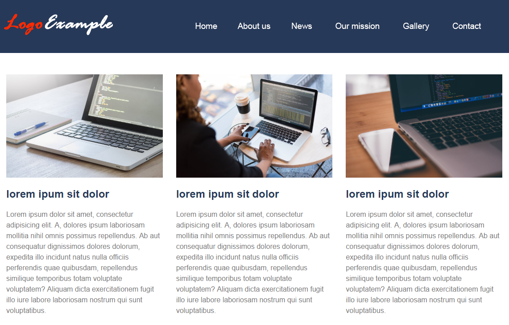
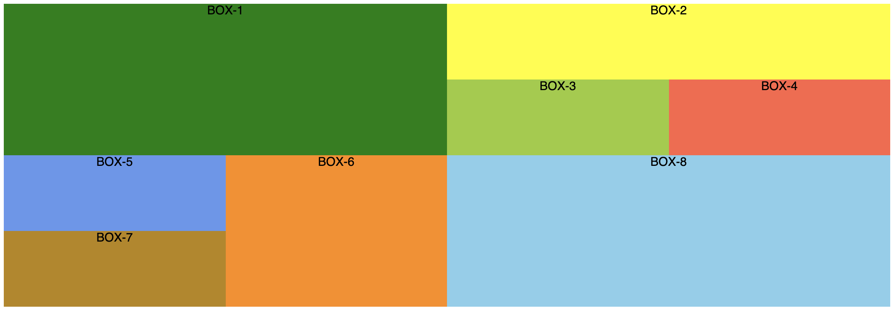

# Important information

Read the following guidelines before doing the exercises.

## How do you begin?

1. [*Fork*](https://guides.github.com/activities/forking/) the repository containing exercises.
2. Clone the repository onto your computer using the command: `git clone repository_address`.
   You will find the address of the repository by pressing "Clone or download" button on its webpage.
3. Complete the exercises and commit changes to your repository using the commands below.
   `git add filename` will add a single file which you have changed.
   If you want to add all the changed files at once, use `git add .`.
   Remember that the fullstop (dot) at the end of this command is important!
   Next, commit changes using `git commit -m "description_of_changes"`.
4. Push changes to your repository on GitHub by typing: `git push origin master`.
5. Create a [*pull request*](https://help.github.com/articles/creating-a-pull-request) to the original repository when you have finished all the exercises.

### Do the exercises in appropriate files.

**The repository with the exercises will be removed 2 weeks after the end of the course. This will result in the removal of all forks made from this repository.**


## Task 1

> ### Preparation
> Modify the `gulpfile.js` so that the `entryPath` variable points to:
> - `01_Task_1`
>
> **Remember to interrupt Gulp (`CTRL+C`) after each change in the `gulpfile.js` and then turn it back on (`gulp`).**

### Header


Give the header `.page-header` a background of the color stored in the variable `$color` (dark blue) and an internal distance of `10px` on each side.  

Use **flexbox** to arrange the logo and navigation on the sides and center them vertically.

Inside the **.main-nav** element there is a list with links.   
It should be cleaned (no `margins`, `padding` and dots) and its elements should be arranged side by side.  

The links in this list should be white, with the size of `18px`, they should have no underscore and have an inner distance set to `20px` on top and bottom and to `30px` on the sides.   


### Main



There are three sample boxes in the **.page-main** element.   

Arrange them next to each other (use Flexbox). There should be a `30px` gap between them.

Additionally, using appropriate styling, make sure that the images do not stick out of the columns.


## Task 2

> ### Preparation
> Modify the `gulpfile.js` so that the `entryPath` variable points to:
> - `02_Task_2`
>
> **Remember to interrupt Gulp (`CTRL+C`) after each change in the `gulpfile.js` and then turn it back on (`gulp`).**


Write a mixin **grad($color1, $color2)** that will take 2 parameters (2 colors), and then generate code for a linear gradient that will be arranged vertically from the first color to the second.

Both parameters **should be optional**. If not specified, then the first color should be white, and the second black.

After creating the mixin add it for the body using the colors `#fff` and `#eee`.


## Task 3

> ### Preparation
> Modify the `gulpfile.js` so that the `entryPath` variable points to:
> - `03_Task_3`
>
> **Remember to interrupt Gulp (`CTRL+C`) after each change in the `gulpfile.js` and then turn it back on (`gulp`).**

**Using Sass**, create all the classes you need to make your own grid. We assume that grid adopts an 8-column layout and the main container is `1200px` wide. Name the classes related to the width of the element `.col-X` - for example `.col-1`, `.col-2` ... `.col-8`.

Do not forget about the classes `container` and `row`.

Individual columns should not have internal spaces (`padding`), their minimum height should be `100px` and the text should be centered.

Using these classes, create the following structure in HTML:



Each of the "boxes" should get their own class for the purpose of assigning color. These classes are already created and have the names: `box-1`, `box-2`, etc.


## Task 4

> ### Preparation
> Modify the `gulpfile.js` so that the `entryPath` variable points to:
> - `04_Task_4`
>
> **Remember to interrupt Gulp (`CTRL+C`) after each change in the `gulpfile.js` and then turn it back on (`gulp`).**


Add the image ```images/sea.jpg``` to the `sea` section as a background image.

Then create a mixin named ```responsiveImage```, which will easily add responsiveness to an element that already has a background image. Mixin should take the natural width and height of the image as parameters. It is supposed to use the height and width to increase the background with ```padding-bottom```. Remember to set ```height``` to **0** and add appropriate background properties.

Finally, call the mixin on the section with the ```section-4``` class using the previously used image, whose natural dimensions are __1920px__ width and __1080px__ height.

Remember - the responsive background image scales with the screen width and maintains its proportions!
